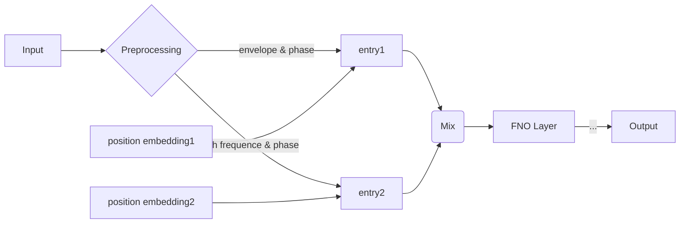

# FNO-USTC

An FNO based model builded for speed ​​reconstruction in ultrasound CT imaging.

## Model



## Data

The data used for training is generated by DP, which can be obtained in [this competition](https://bohrium.dp.tech/competitions/2522351329) and their upcoming papers.

Download the data and put it in the `data` folder.

## Training

First, set up the conifguration in `config.toml`.

Then, run the following command to train the model.

```bash
python train.py
```

The training process will be saved in the `runs` folder and can be monitoring using tensorboard.

Checkpoints will be saved in the `checkpoints` folder.

## Inference

```bash
python inference.py -m <model_path> -i <data_path>
```

## License

MIT
